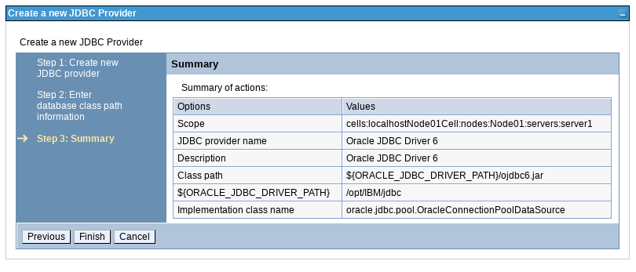

Crear Datasource en WAS (Websphere Application Server) 8.0
++++++++++++

- Primero procedemos a crear un authentication alias. Ingresamos a la consola administrativa de WAS y seleccionamos la pestaña Security, y luego Global Security::

- Luego en la pestaña Java Authentication y Autoritazion Service, seleccionamos J2C authentication data:

- Seleccionamos New para crear los datos de autenticación:

- Ingresamos el alias, el usuario, el password y la descripción. Luego que le damos ok, guardamos los cambios:

- Seguidamente creamos el JDBC provider, que es es el driver que nos va a permitir la conexión hacia la base de datos:

- En la pestaña que tiene por defecto All scopes, seleccionamos el nodo y el server:

- Seleccionamos la opción New para crear el nuevo JDBC provider:

- Colocamos el tipo de base de datos, el nombre y la descripción:

- Le decimos la ruta del sistema operativo a donde se encuentra el JDBC que vamos a utilizar:

- Nos muestra un resumen de la creación:

- Ya el jdbc fue creado y le damos a guardar:

- Luego en la misma pestaña de JDBC en el menú principal, seleccionamos Data sources. Donde dice All scopes colocamos el nodo y el server:

.. image:: ../imagenes/datasource/064.png

- Seleccionamos New para crear el nuevo datasource:

- Ingresamos el nombre del datasource y del JNDI:

- Seleccionamos el JDBC provider ya creado previamente:

- Indicamos la URL de la base de datos:

- Seleccionamos el authentication alias creado con anterioridad:

- Nos muestra el resumen de la creación del datasource y le damos finalizar:

- Una vez creado el datasource le damos a la opción guardar:

- Nos muestra un mensaje que el datasource fue creado satisfactoriamente:

- Procedemos a crear un segundo datasource que incluirá los mismos pasos para fines de practica:

.. image:: ../imagenes/datasource/077.png

