Intalar FIX en WAS (Websphere Application Server) 8.0
++++++++++++

- Ingresamos vía ssh al servidor con el parámetro de las X, para realizar la instalación. Ya debemos tener instalado el Instalation Manager de IBM::

	$ ssh -X ibm@192.168.0.237
	ibm@192.168.0.237's password: 
	Last login: Thu Jan  3 15:36:12 2019 from 192.168.0.43

- Luego nos vamos a la carpeta de IM, seguidamente InstallationManager, y luego eclipse y ejecutamos el script IBMIM para iniciar la instalación::

	[ibm@was was]$ cd ..
	[ibm@was IBM]$ cd IM/
	[ibm@was IM]$ cd InstallationManager/
	[ibm@was InstallationManager]$ cd eclipse/
	[ibm@was eclipse]$ ./IBMIM

- Lo primero que nos mostrará es la ventana de instalación y le damos al boton de file y preferences:

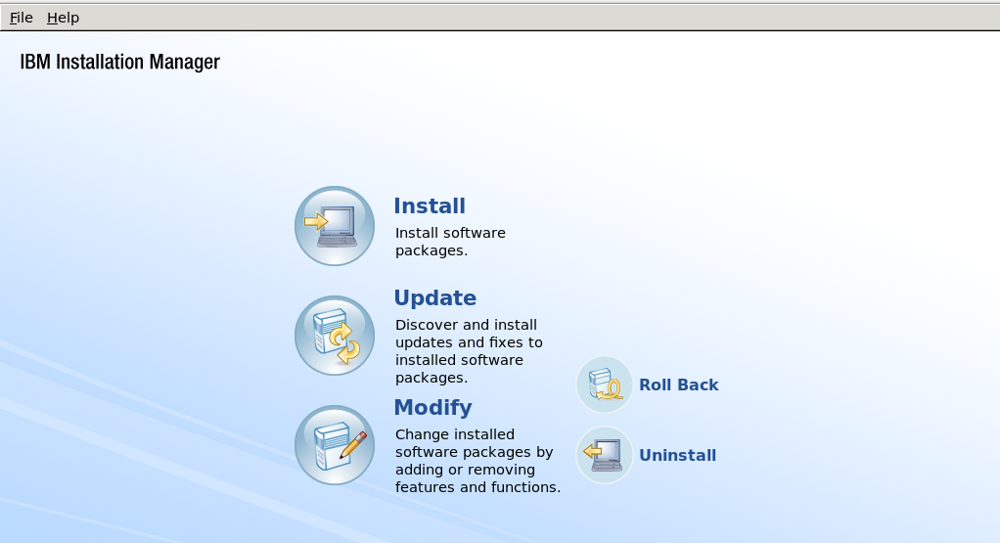

- Debemos proceder a añadir un nuevo repositorio, y para ello buscamos la ruta del instalador del fix y el archivo repository.config:

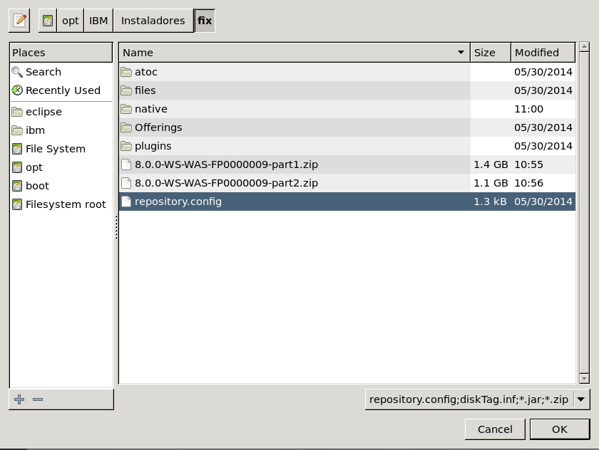

- Nos muestra la ruta seleccionada y le damos ok::

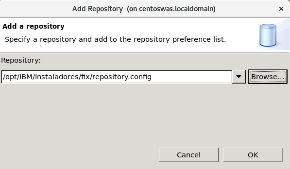

- Ya nos muestra el repositorio añadido y le volvemos a dar ok:

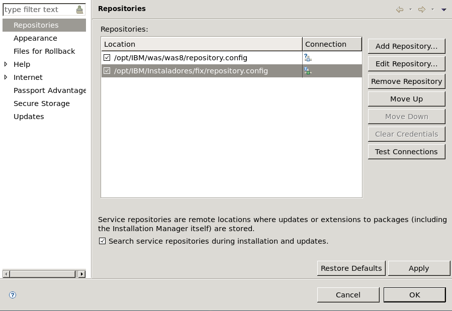

- Luego en la ventana principal le damos a Update y nos pide credenciales para conectarse al repositorio por defecto de ibm, pero como ya tenemos el fix descargado le damos a cancelar:

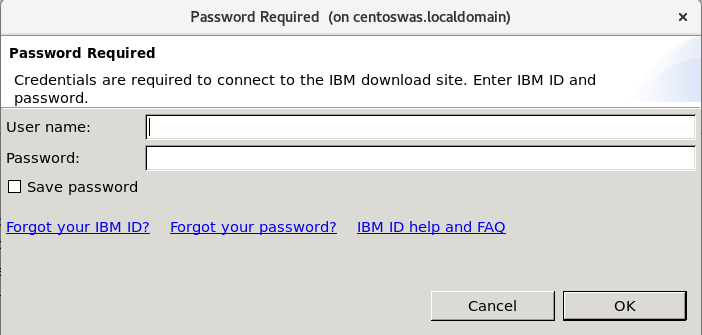

- Nos muestra el parche disponible para instalación y seleccionamos siguiente:

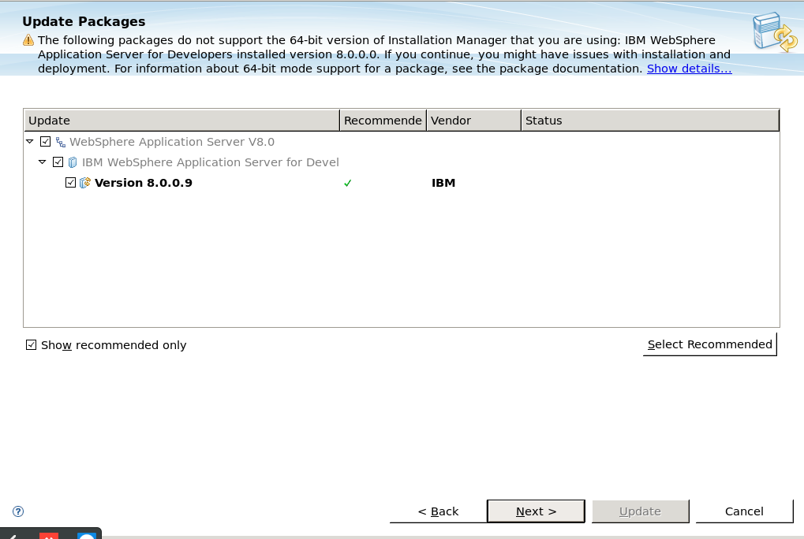

- Aceptamos los términos de la licencia:

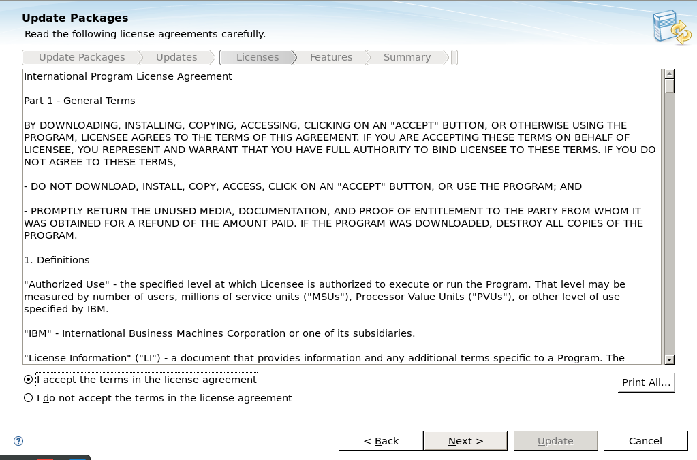

- Nos muestra las características del parche y las dejamos por defecto:

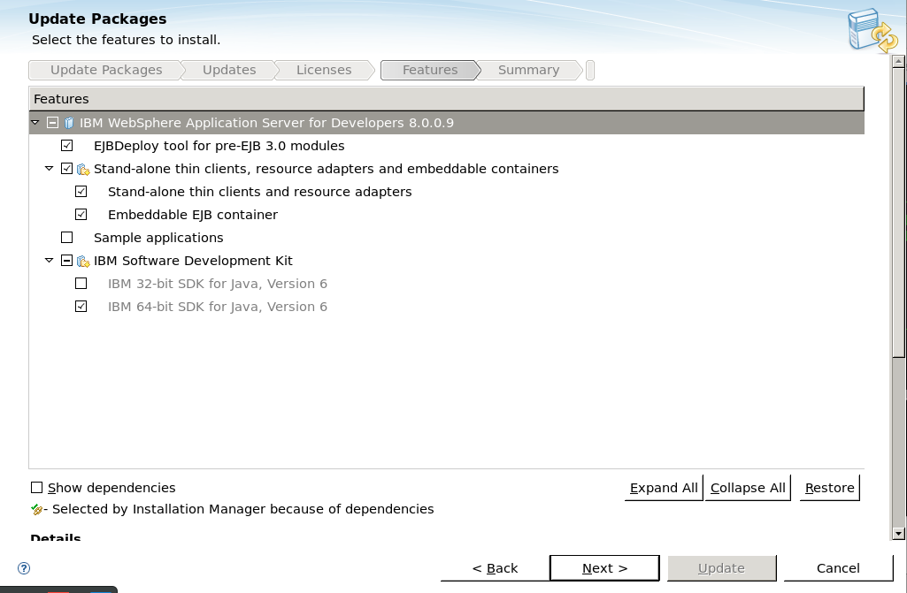

- Nos muestra el resumen de la instalación y de estar todo bien le damos al botón Update:

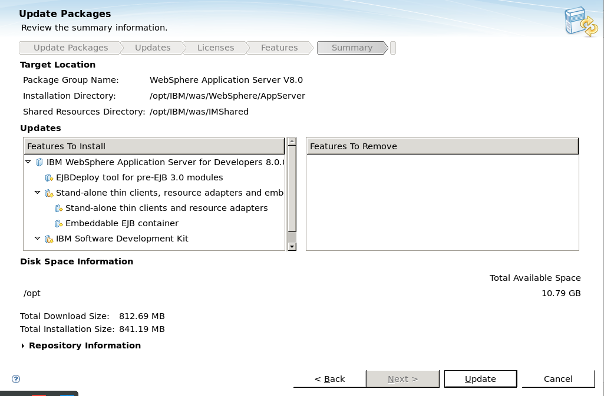

- Seguidamente visualizaremos el porcentaje de actualización:

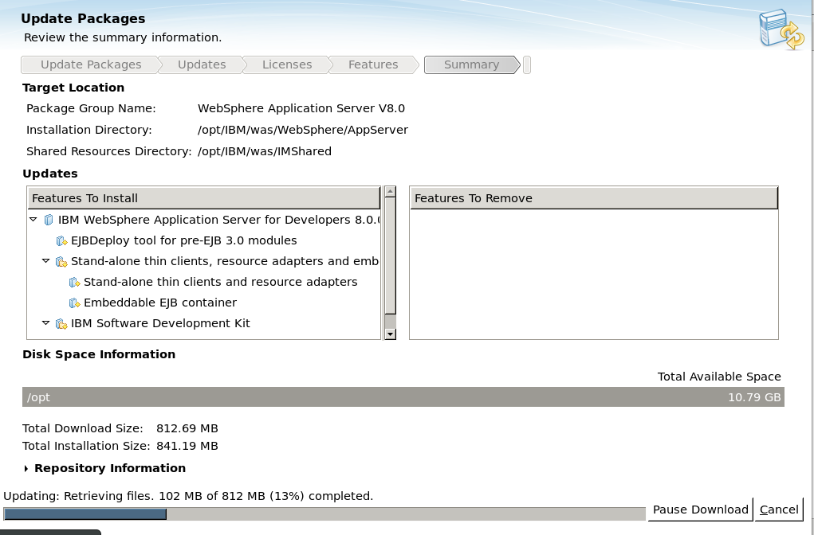

- Luego de la instalación, nos debe indicar que el paquete fue actualizado:

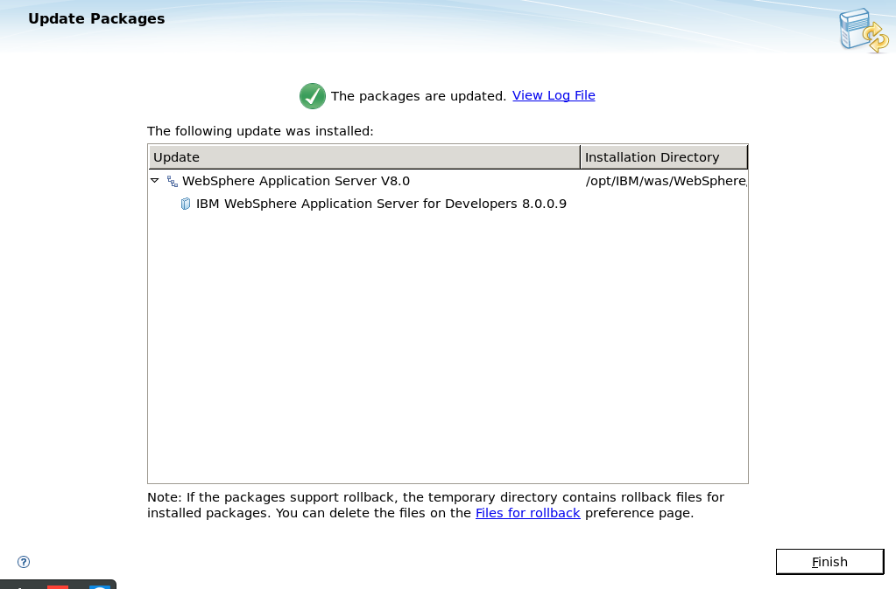

- Finalmente si ingresamos a la consola administrativa del WAS, podremos visualizar la versión del servidor de aplicación con el número de parche:

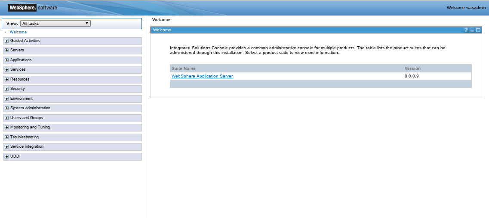

