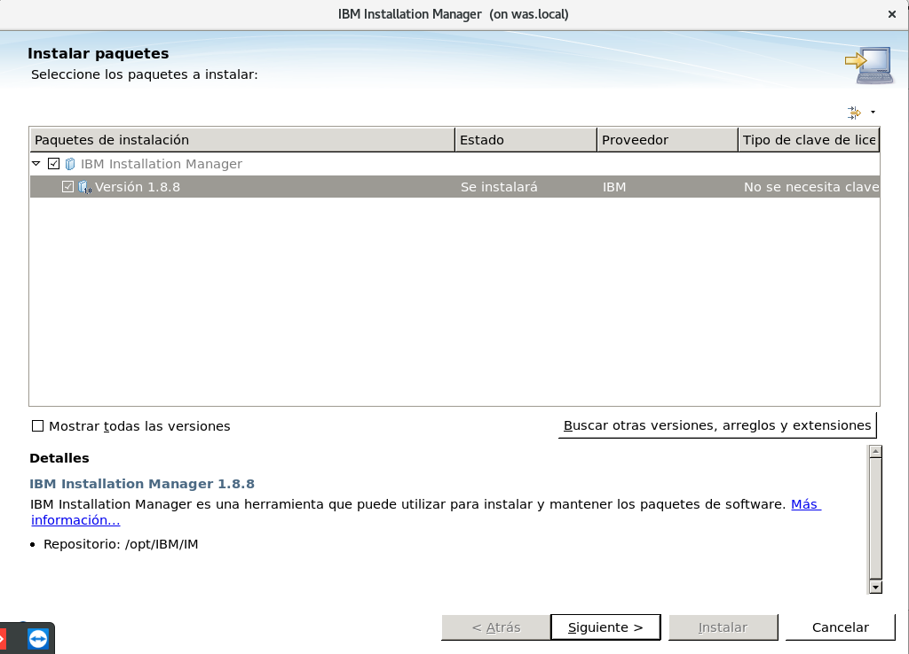
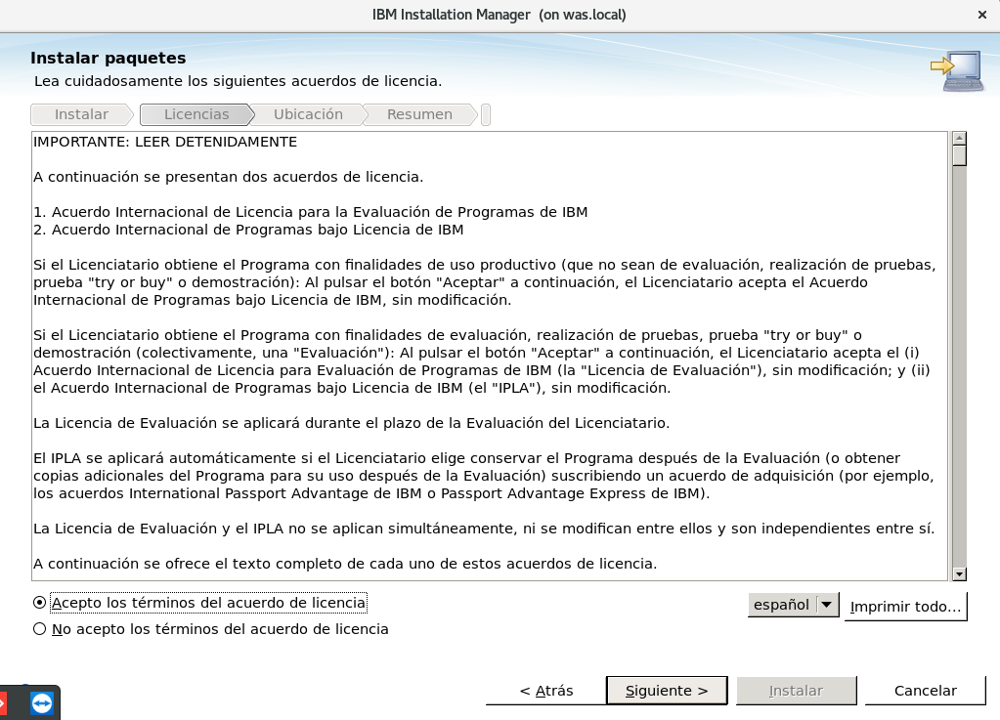
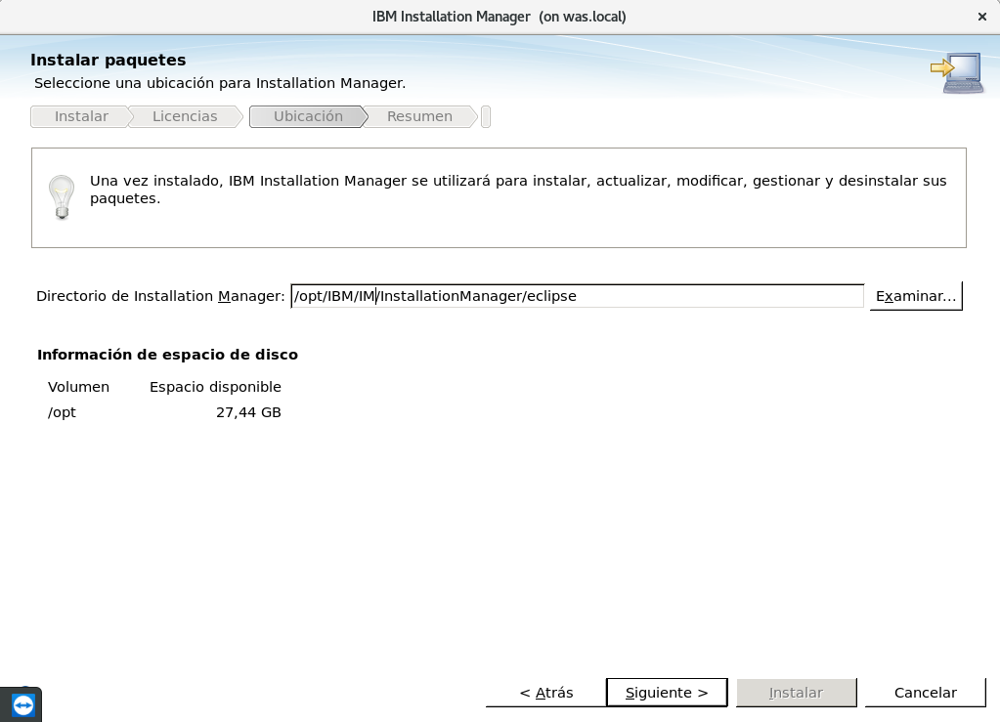
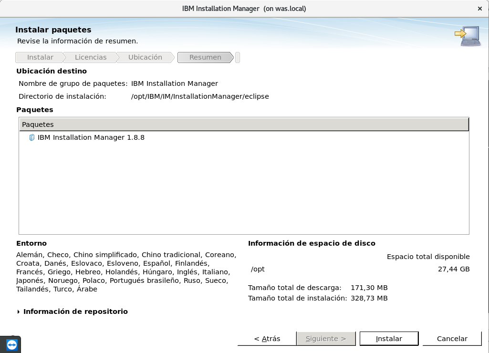
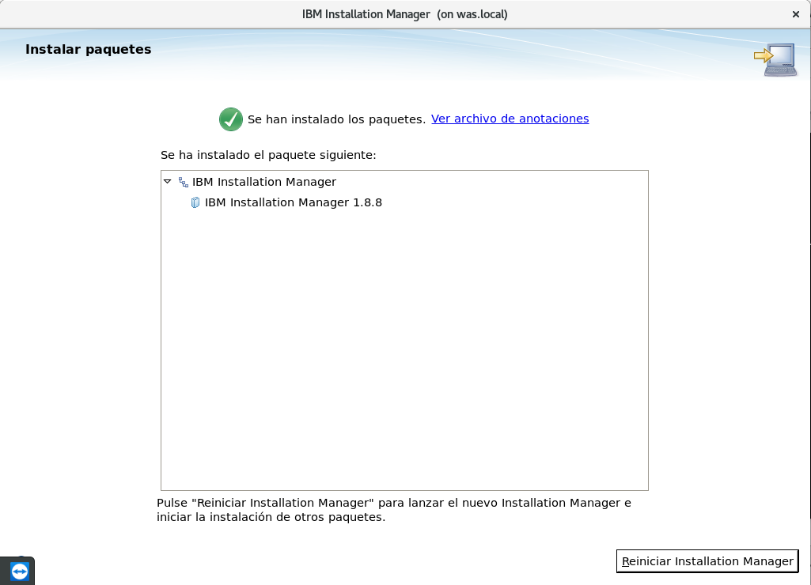

Instalación de IBM Instalation Manager
++++++++++++

- Primero debemos crear un usuario de servicio::

	[root@was ~]# useradd ibm
	[root@was ~]# passwd ibm
	Cambiando la contraseña del usuario ibm.
	Nueva contraseña: 
	Vuelva a escribir la nueva contraseña: 
	passwd: todos los símbolos de autenticación se actualizaron con éxito.

- Luego nos salimos y hacemos la conexión de ssh con dicho usuario con el parámtro -X para activar las ventanas x, que las necesitaremos en la instalación (se deben descargar los paquetes necesarios)::

	ssh -X ibm@192.168.0.237
	ibm@192.168.0.237's password: 
	/usr/bin/xauth:  file /home/ibm/.Xauthority does not exist
	[ibm@was ~]$ 
	[ibm@was ~]$ echo $DISPLAY
	localhost:10.0

- Procedemos a crear el directorio de trabajo::

	[ibm@was ~]$ cd /opt/
	[ibm@was opt]$ sudo mkdir IBM
	[ibm@was opt]$ mkdir IBM/IM

- Creamos de una vez una carpeta de Instaladores para separar los paquetes que vayan a ser instalados::

	[ibm@was opt]$ sudo mkdir IBM/Instaladores

- Le otorgamos permiso al usuario de servicio sobre todo el directorio de trabajo::

	[ibm@was opt]$ sudo chown -R ibm. /opt/IBM/
	[ibm@was opt]$ ls -ld IBM/
	drwxr-xr-x. 4 ibm ibm 4096 ene  3 11:42 IBM/

- Nos vamos a la carpeta que creamos con el nombre de IM a donde vamos a descomprimir el empaquetado de Instalation Manager de IBM::

	[ibm@was IM]$ ls
	agent.installer.linux.gtk.x86_64_1.8.8000.20171130_1105.zip
	[ibm@was IM]$ unzip agent.installer.linux.gtk.x86_64_1.8.8000.20171130_1105.zip

- Para realizar la instalacion si es con root utilizamos install si es con otro usuario userinst::

	[ibm@was IM]$ ./userinst

- En este caso nos está dando un error indicando que falta una librería::

	00:00.39 ERROR [main] com.ibm.cic.agent.internal.ui.AgentUI reportStatus
	  Could not load SWT library. Reasons: 
	  	/opt/IBM/IM/configuration/org.eclipse.osgi/bundles/394/1/.cp/libswt-pi-gtk-4239.so (libgtk-x11-2.0.so.0: no se puede abrir el fichero del objeto compartido: No existe el fichero o el directorio)
	  	swt-pi-gtk (Not found in java.library.path)
	  	/home/ibm/.swt/lib/linux/x86_64/libswt-pi-gtk-4239.so (/home/ibm/.swt/lib/linux/x86_64/liblibswt-pi-gtk-4239.so.so: no se puede abrir el fichero del objeto compartido: No existe el fichero o el directorio)
	  	/home/ibm/.swt/lib/linux/x86_64/libswt-pi-gtk.so (/home/ibm/.swt/lib/linux/x86_64/liblibswt-pi-gtk.so.so: no se puede abrir el fichero del objeto compartido: No existe el fichero o el directorio)
	  	/home/ibm/.swt/lib/linux/x86_64/libswt-pi-gtk-4239.so (libgtk-x11-2.0.so.0: no se puede abrir el fichero del objeto compartido: No existe el fichero o el directorio)
	  java.lang.UnsatisfiedLinkError: Could not load SWT library. Reasons: 
		/opt/IBM/IM/configuration/org.eclipse.osgi/bundles/394/1/.cp/libswt-pi-gtk-4239.so (libgtk-x11-2.0.so.0: no se puede abrir el fichero del objeto compartido: No existe el fichero o el directorio)
		swt-pi-gtk (Not found in java.library.path)
		/home/ibm/.swt/lib/linux/x86_64/libswt-pi-gtk-4239.so (/home/ibm/.swt/lib/linux/x86_64/liblibswt-pi-gtk-4239.so.so: no se puede abrir el fichero del objeto compartido: No existe el fichero o el directorio)
		/home/ibm/.swt/lib/linux/x86_64/libswt-pi-gtk.so (/home/ibm/.swt/lib/linux/x86_64/liblibswt-pi-gtk.so.so: no se puede abrir el fichero del objeto compartido: No existe el fichero o el directorio)
		/home/ibm/.swt/lib/linux/x86_64/libswt-pi-gtk-4239.so (libgtk-x11-2.0.so.0: no se puede abrir el fichero del objeto compartido: No existe el fichero o el directorio)

	    at org.eclipse.swt.internal.Library.loadLibrary(Library.java:331)
	    at org.eclipse.swt.internal.Library.loadLibrary(Library.java:240)
	    at org.eclipse.swt.internal.gtk.OS.<clinit>(OS.java:23)
	    at java.lang.J9VMInternals.initializeImpl(Native Method)
	    ...
	La visualización no se ha podido inicializar.  Consulte más detalles en el registro de anotaciones /opt/IBM/IM/configuration/1546530675824.log.

- Con el comando ldd podemos ver las librerias dependientes de la otra librería que nos hace referencia el error::

	[ibm@was IM]$ ldd /opt/IBM/IM/configuration/org.eclipse.osgi/bundles/394/1/.cp/libswt-pi-gtk-4239.so
	ldd: atención: no tiene permiso de ejecitación para `/opt/IBM/IM/configuration/org.eclipse.osgi/bundles/394/1/.cp/libswt-pi-gtk-4239.so'
	linux-vdso.so.1 =>  (0x00007ffe429d0000)
	libgtk-x11-2.0.so.0 => not found
	libgthread-2.0.so.0 => /lib64/libgthread-2.0.so.0 (0x00007fbd33f33000)
	libXtst.so.6 => /lib64/libXtst.so.6 (0x00007fbd33d2d000)
	libc.so.6 => /lib64/libc.so.6 (0x00007fbd33960000)
	libglib-2.0.so.0 => /lib64/libglib-2.0.so.0 (0x00007fbd3364a000)
	libpcre.so.1 => /lib64/libpcre.so.1 (0x00007fbd333e8000)
	libpthread.so.0 => /lib64/libpthread.so.0 (0x00007fbd331cc000)
	libX11.so.6 => /lib64/libX11.so.6 (0x00007fbd32e8e000)
	libXext.so.6 => /lib64/libXext.so.6 (0x00007fbd32c7c000)
	libXi.so.6 => /lib64/libXi.so.6 (0x00007fbd32a6c000)
	/lib64/ld-linux-x86-64.so.2 (0x00007fbd34135000)
	libxcb.so.1 => /lib64/libxcb.so.1 (0x00007fbd32844000)
	libdl.so.2 => /lib64/libdl.so.2 (0x00007fbd32640000)
	libXau.so.6 => /lib64/libXau.so.6 (0x00007fbd3243c000)

- En este caso nos dice que para que funcione la libreria libswt-pi-gtk-4239.so le falta la librería libgtk-x11-2.0.so.0.

- Instalamos el paquete gtk2::

	[ibm@was IM]$ yum install gtk2.x86_64

- Y al hacer el ldd ya nos muestra la librería faltante mas otras que no visualizabamos::

	[ibm@was IM]$ ldd /opt/IBM/IM/configuration/org.eclipse.osgi/bundles/394/1/.cp/libswt-pi-gtk-4239.so
	ldd: atención: no tiene permiso de ejecitación para `/opt/IBM/IM/configuration/org.eclipse.osgi/bundles/394/1/.cp/libswt-pi-gtk-4239.so'
	linux-vdso.so.1 =>  (0x00007ffc185d2000)
	libgtk-x11-2.0.so.0 => /lib64/libgtk-x11-2.0.so.0 (0x00007f96dfbf9000)
	libgthread-2.0.so.0 => /lib64/libgthread-2.0.so.0 (0x00007f96df9f7000)
	libXtst.so.6 => /lib64/libXtst.so.6 (0x00007f96df7f1000)
	libc.so.6 => /lib64/libc.so.6 (0x00007f96df424000)
	libgdk-x11-2.0.so.0 => /lib64/libgdk-x11-2.0.so.0 (0x00007f96df163000)
	libgmodule-2.0.so.0 => /lib64/libgmodule-2.0.so.0 (0x00007f96def5f000)
	libpangocairo-1.0.so.0 => /lib64/libpangocairo-1.0.so.0 (0x00007f96ded51000)
	libX11.so.6 => /lib64/libX11.so.6 (0x00007f96dea13000)
	libXfixes.so.3 => /lib64/libXfixes.so.3 (0x00007f96de80d000)
	libatk-1.0.so.0 => /lib64/libatk-1.0.so.0 (0x00007f96de5e7000)
	libcairo.so.2 => /lib64/libcairo.so.2 (0x00007f96de2b0000)
	libgdk_pixbuf-2.0.so.0 => /lib64/libgdk_pixbuf-2.0.so.0 (0x00007f96de088000)
	libgio-2.0.so.0 => /lib64/libgio-2.0.so.0 (0x00007f96ddce9000)
	libpangoft2-1.0.so.0 => /lib64/libpangoft2-1.0.so.0 (0x00007f96ddad3000)
	libpango-1.0.so.0 => /lib64/libpango-1.0.so.0 (0x00007f96dd88d000)
	libfontconfig.so.1 => /lib64/libfontconfig.so.1 (0x00007f96dd64b000)
	libgobject-2.0.so.0 => /lib64/libgobject-2.0.so.0 (0x00007f96dd3fb000)
	libglib-2.0.so.0 => /lib64/libglib-2.0.so.0 (0x00007f96dd0e5000)
	libm.so.6 => /lib64/libm.so.6 (0x00007f96dcde3000)
	libpthread.so.0 => /lib64/libpthread.so.0 (0x00007f96dcbc7000)
	libpcre.so.1 => /lib64/libpcre.so.1 (0x00007f96dc965000)
	libXext.so.6 => /lib64/libXext.so.6 (0x00007f96dc753000)
	libXi.so.6 => /lib64/libXi.so.6 (0x00007f96dc543000)
	/lib64/ld-linux-x86-64.so.2 (0x00007f96e027b000)
	libXrender.so.1 => /lib64/libXrender.so.1 (0x00007f96dc338000)
	libXinerama.so.1 => /lib64/libXinerama.so.1 (0x00007f96dc135000)
	libXrandr.so.2 => /lib64/libXrandr.so.2 (0x00007f96dbf2a000)
	libXcursor.so.1 => /lib64/libXcursor.so.1 (0x00007f96dbd1f000)
	libXcomposite.so.1 => /lib64/libXcomposite.so.1 (0x00007f96dbb1c000)
	libXdamage.so.1 => /lib64/libXdamage.so.1 (0x00007f96db919000)
	libdl.so.2 => /lib64/libdl.so.2 (0x00007f96db715000)
	libfreetype.so.6 => /lib64/libfreetype.so.6 (0x00007f96db456000)
	libxcb.so.1 => /lib64/libxcb.so.1 (0x00007f96db22e000)
	libpixman-1.so.0 => /lib64/libpixman-1.so.0 (0x00007f96daf85000)
	libEGL.so.1 => /lib64/libEGL.so.1 (0x00007f96dad71000)
	libpng15.so.15 => /lib64/libpng15.so.15 (0x00007f96dab46000)
	libxcb-shm.so.0 => /lib64/libxcb-shm.so.0 (0x00007f96da942000)
	libxcb-render.so.0 => /lib64/libxcb-render.so.0 (0x00007f96da734000)
	libz.so.1 => /lib64/libz.so.1 (0x00007f96da51e000)
	libGL.so.1 => /lib64/libGL.so.1 (0x00007f96da292000)
	librt.so.1 => /lib64/librt.so.1 (0x00007f96da08a000)
	libffi.so.6 => /lib64/libffi.so.6 (0x00007f96d9e82000)
	libselinux.so.1 => /lib64/libselinux.so.1 (0x00007f96d9c5b000)
	libresolv.so.2 => /lib64/libresolv.so.2 (0x00007f96d9a42000)
	libmount.so.1 => /lib64/libmount.so.1 (0x00007f96d97ff000)
	libgcc_s.so.1 => /lib64/libgcc_s.so.1 (0x00007f96d95e9000)
	libharfbuzz.so.0 => /lib64/libharfbuzz.so.0 (0x00007f96d934c000)
	libthai.so.0 => /lib64/libthai.so.0 (0x00007f96d9140000)
	libfribidi.so.0 => /lib64/libfribidi.so.0 (0x00007f96d8f24000)
	libexpat.so.1 => /lib64/libexpat.so.1 (0x00007f96d8cfa000)
	libuuid.so.1 => /lib64/libuuid.so.1 (0x00007f96d8af5000)
	libbz2.so.1 => /lib64/libbz2.so.1 (0x00007f96d88e5000)
	libXau.so.6 => /lib64/libXau.so.6 (0x00007f96d86e1000)
	libGLdispatch.so.0 => /lib64/libGLdispatch.so.0 (0x00007f96d842b000)
	libGLX.so.0 => /lib64/libGLX.so.0 (0x00007f96d81f9000)
	libblkid.so.1 => /lib64/libblkid.so.1 (0x00007f96d7fb9000)
	libgraphite2.so.3 => /lib64/libgraphite2.so.3 (0x00007f96d7d8b000)

- Y al ejecutar el userinst nos muestra la ventana de instalación con el paquete que se va a instalar y le damos a siguiente::

	[ibm@was IM]$ ./userinst

- Nos muestra la licencia la cual debemos aceptar:

- Luego le debemos especificar el directorio del Instalation Manager:

- Seguidamente nos muestra un resumen, y de estar todo bien le damos a instalar:

- Finalmente nos indica que se ha instalado correctamente el paquete de Instalación:

- Este producto nos servirá para instalar paquetes IBM como WAS.

