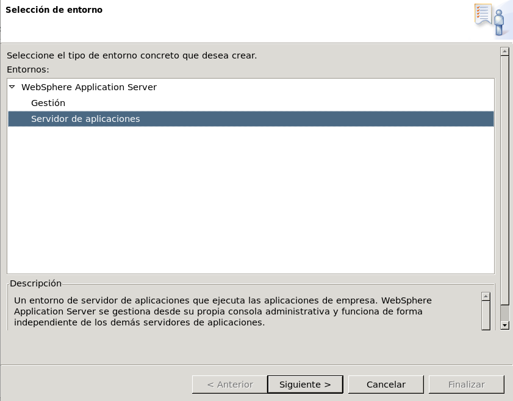
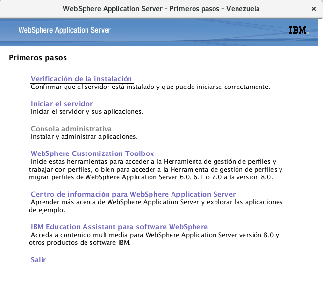

Instalación de WAS (Websphere Application Server) 8.0
++++++++++++

- Ingresamos vía ssh al servidor con el parámetro de las X, para realizar la instalación. Ya debemos tener instalado el Instalation Manager de IBM y creado un usuario de servicio::

	$ ssh -X ibm@192.168.0.237
	ibm@192.168.0.237's password: 
	Last login: Thu Jan  3 15:36:12 2019 from 192.168.0.43

- Creamos la carpeta was para descomprimir el empaquetado de was 8::

	[ibm@was IBM]$ mkdir was
	[ibm@was IBM]$ ls
	IM  Instaladores  was
	[ibm@was IBM]$ pwd
	/opt/IBM
	$ cd was/
	[ibm@was was]$ ls
	was8.tar
	[ibm@was was]$ tar -xvf was8.tar

- Luego nos vamos a la carpeta de IM, seguidamente InstallationManager, y luego eclipse y ejecutamos el script IBMIM para iniciar la instalación::

	[ibm@was was]$ cd ..
	[ibm@was IBM]$ cd IM/
	[ibm@was IM]$ cd InstallationManager/
	[ibm@was InstallationManager]$ cd eclipse/
	[ibm@was eclipse]$ ./IBMIM

- Lo primero que nos mostrará la ventana de instalación::

- Luego le damos al boton de Archivo y preferencias:

- Le damos a añadir repositorios:

- Buscamos la ruta a donde descomprimimos el paquete de was8, y seleccionamos repository.config para agregarlo:

- Añadimos el repositorio:

- Y ya lo podemos observar en la lista de repositorios y le damos a aceptar:

- Luego volvemos a la pantalla de Instalación y seleccionamos instalar, valga la redundancia:

- Nos muestra el paquete de instalación y le damos a siguiente:

- Aceptamos la licencia:

- Indicamos la ubicación del directorio de recursos compartidos:

- Luego indicamos el directorio de instalación:

- Seleccionamos el la traducción de español por motivos de lengua nativa:

- Dejamos las caraterísticas por defecto y seleccionamos siguiente:

- Al final nos mostrará el resumen y de estar todo bien, procedemos a instalar:

- Luego nos mostrará un mensaje de que los paquetes se han instalado correctamente:

- Seguidamente nos abre el toolbox para crear el perfil:

- Seleccionamos el tipo de entorno que en este caso es servidor de aplicación:

- Le damos a la opción de creación de perfiles avanzada:

- Seleccionamos las 2 opciones de despliegue de aplicaciones:

- Colocamos el nombre del perfil y el directorio a donde se va a crear:

- Colocamos el nombre del nodo, el nombre del servidor y el nombre del host:

- Ingresamos el usuario administrativo y su contraseña:

- En las opciones de certificados le damos a crear un nuevo certificado personal por omisión para que lo cree por defecto:

- Nos mostrará los datos de los certificados y la CA emitidos y el tiempo de caducidad:

- Luego podemos ver los puertos por defecto que utilizará la aplicación los cuales podemos modificar a nuestra conveniencia:

- Al seguir de manera opcional podemos configurar un servidor web para direccionar peticiones al servidor de aplicación. Pero en este caso no lo haremos:

- Nos muestra el resumen de la creación del perfil:

- Carga el proceso de creación de perfiles:

- Nos debe indicar que el perfil se a creado exitosamente y le damos finalizar:

- Nos aparecerá la ventana de Primeros Pasos para verificación de funcionalidades, que puede comprobar si gusta:

- Si no iniciamos el servidor en la ventana de primeros pasos, lo iniciamos de forma manual con el script startServer.sh, que en nuestro caso está en la ruta /opt/IBM/was/WebSphere/AppServer/profiles/Venezuela/bin. Aquí estamos levantando el perfil, incluyendo los puertos del server y de la consola administrativa::

	[ibm@was bin]$ ./startServer.sh was1
	ADMU0116I: La información de la herramienta se está anotando en el archivo
		   /opt/IBM/was/WebSphere/AppServer/profiles/Venezuela/logs/was1/startServer.log
	ADMU0128I: Iniciando herramienta con el perfil Venezuela
	ADMU3100I: Leyendo la configuración para el servidor: was1
	ADMU3200I: El servidor se ha iniciado. Esperando el estado de inicialización.
	ADMU3000I: Servidor was1 abierto para e-business; el ID de proceso es 6902

- Consultamos la consola administrativa vía web, a través del puerto que le definimos en la creación del perfil (se deben tomar en cuenta las iptables), e ingresamos con el usuario creado durante la instalación:

- Ingresamos satisfactoriamente a la consola de administración:

- Si ingresamos a servidores de aplicación de Websphere, podremos ver dicho servidor con su nodo y el nombre del host en que fue instalado:

	

