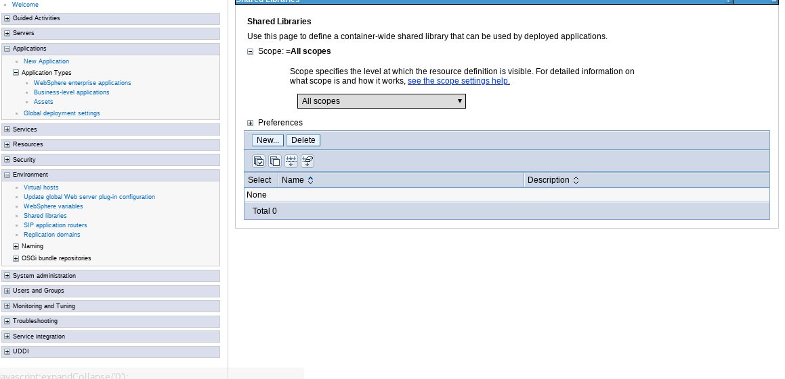
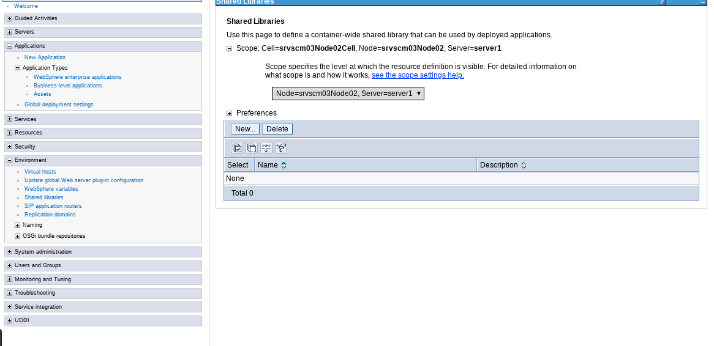
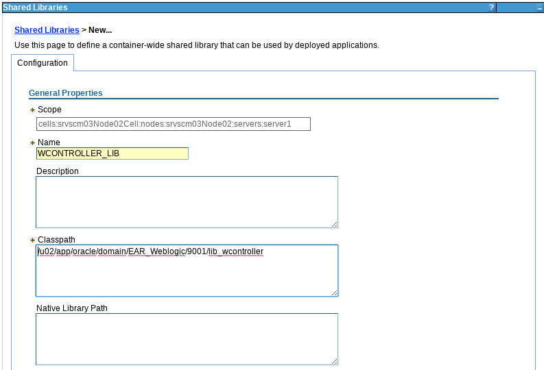
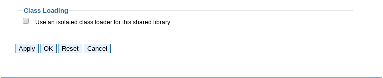
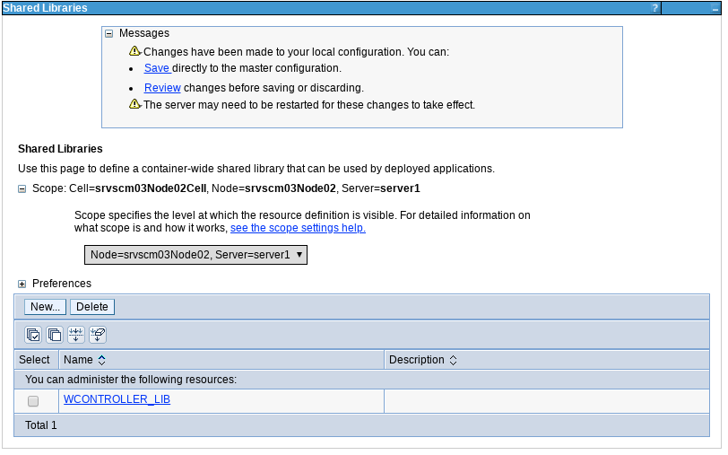
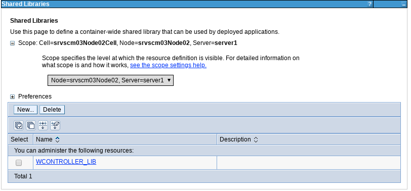

Creación de Shared Libraries en WAS (Websphere Application Server) 8.0
++++++++++++

Los shared libraries son archivos utilizados por varias aplicaciones. Cree una biblioteca compartida para reducir el número de archivos duplicados de bibliotecas en el sistema.

- En el menú principal de la consola administrativa, seleccionamos Environment, y luego shared libraries:

- En la ventana que dice all scopes seleccionamos el nodo y el servidor correspondiente, y le damos a la opción New:

- le asignamos el nombre a la shared librarie y la ruta del sistema operativo en la que estará ubicada:

- Le damos a la opción Ok para proceder a crearla:

- Guardamos los cambios y ya observamos la shared librarie creada:

- Nos muestra un mensaje que ya la shared librarie puede ser usada para aplicaciones desplegadas:

- 
