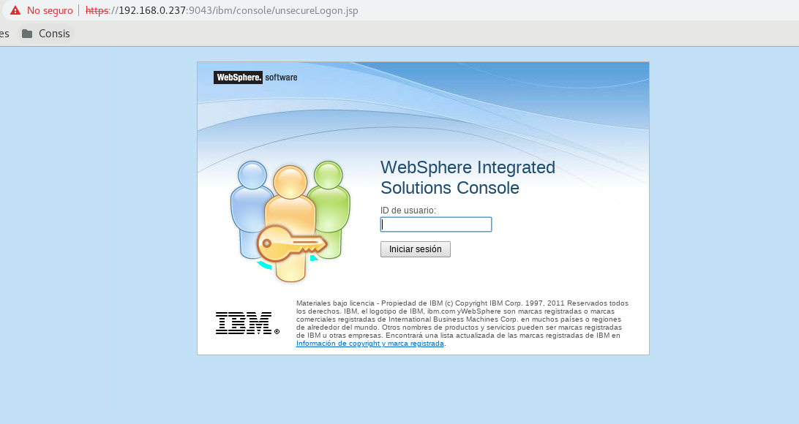
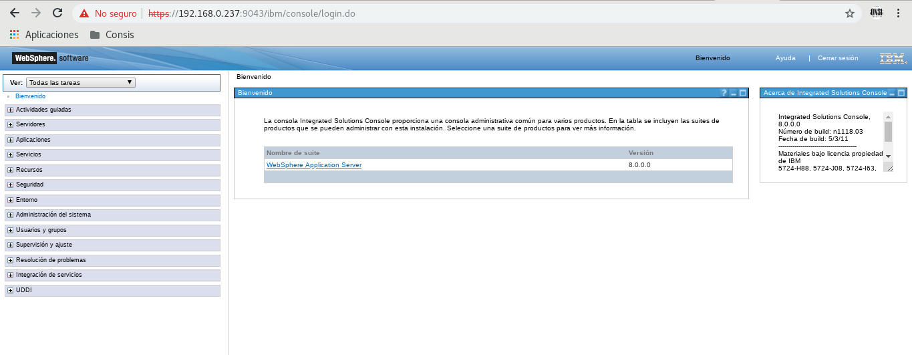

Deshabilitar seguridad en consola administrativa de WAS
++++++++++++

- El archivo que se modifica cuando vamos a deshabilitar o habilitar la seguridad en la consola administrativa es el security.xml, que en nuestro caso está ubicado en la ruta /opt/IBM/was/WebSphere/AppServer/profiles/Venezuela/config/cells/wasNode01Cell. Por seguridad debemos respaldarlo antes de realizar alguna modificación. En casod e no respaldar, sólo cambiará enabled="false" o enabled="true" dentro de la pestaña de seguridad del archivo, dependiendo de cual sea el caso.

- Luego nos vamos a la ruta de los binarios del perfil para ejecutar la consola de administrativa a traves de comandos::

	[ibm@was bin]$ pwd
	/opt/IBM/was/WebSphere/AppServer/profiles/Venezuela/bin
	[ibm@was bin]$ 
	[ibm@was bin]$ ./wsadmin.sh
	WASX7209I: Conexión con el proceso "was1" en el nodo Caracas mediante el conector SOAP; el tipo de proceso es: UnManagedProcess
	WASX7029I: Para obtener ayuda, entre: "$Help help"

- Desactivamos la seguridad con el siguiente comando::

	wsadmin>securityoff
	LOCAL OS security is off now but you need to restart server1 to make it affected.
	wsadmin>exit

- Y reiniciamos el server con los comandos stopServer.sh y startServer.sh ubicados en los binarios del perfil

- Luego buscamos de ingresar vía web por la consola administrativa y nos percatamos de que solo pide ID de usuario:

- Y si le damos ingresar sin poner ningun ID ingresamos de manera satisfatoria:

